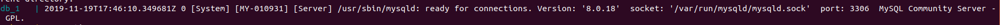
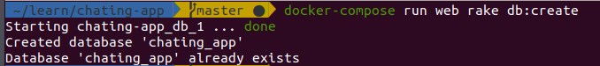
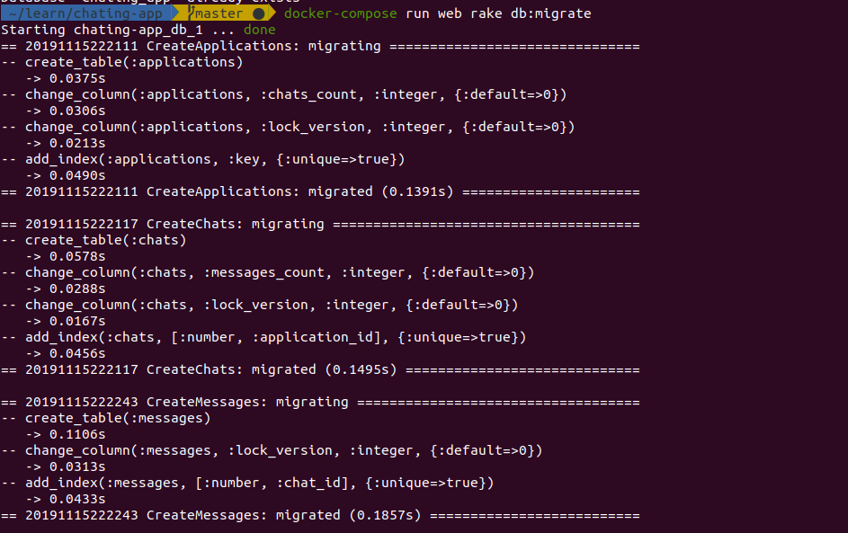

# Installing the app

## Downloading the app
```sh
git clone https://github.com/muhammedkamel/chating-app.git
```

## Building and running containers

> Open two terminals and enter the project directory `cd chating-app` 

> Run this command on **terminal one** and wait until it creates the required containers
```sh
docker-compose up
```

The containers are up and running if you see this: 

## Creating database

> Create the db and run the migration script on **termial two**

```sh
docker-compose run web rake db:create
```

You should see: 

## Creating the database schema
```sh
docker-compose run web rake db:migrate
```

You should see: 

# Consume the API
> You can import the API in postman using this [link](https://www.getpostman.com/collections/a74866d57b83f6fe9c83) `https://www.getpostman.com/collections/a74866d57b83f6fe9c83`